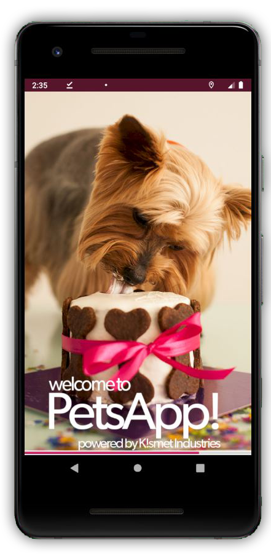
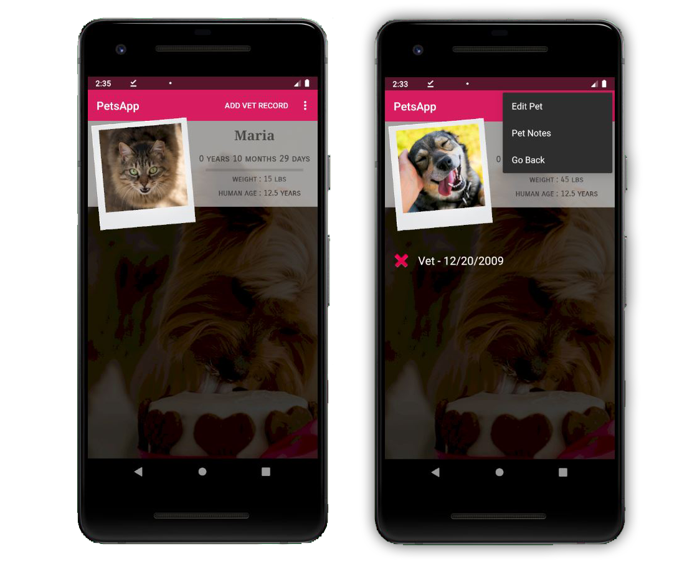
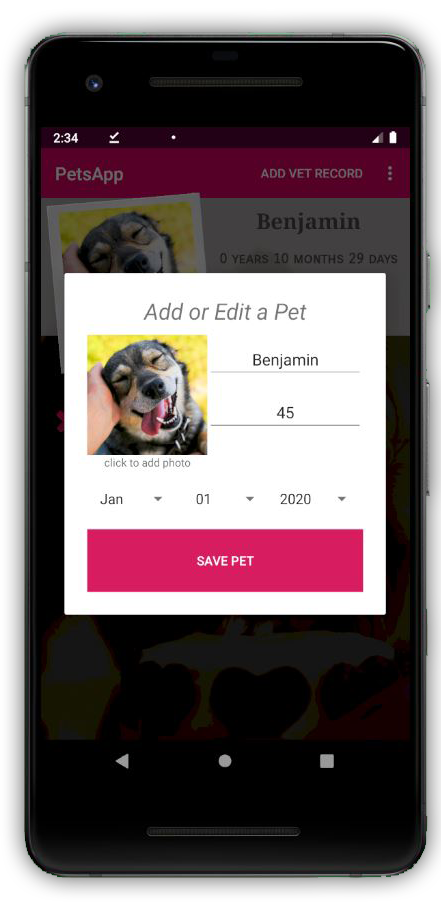

# PetsApp
**[PetsApp on GooglePlay](https://play.google.com/store/apps/details?id=com.kismet.petsapp)**

## Description
PetsApp is a mobile application available on **Google Play** that trackd and stores information about pets. It is designed as a hub of pet information for the involved owner. PetsApp not only tracks birthdays realtime in days and years, but you can also add photos of vetrecords for each pet to pull them up and view them later. There is also a notepad feature so you can write notes about each pet. All information is stored and retrieved by picking a pet from the list.

## Technologies
This project was written in **Java** and is attached to a **SQL** database. The  **Java** language was chosen because it is an object-oriented language and allowed for efficient creating and passing of pet objects around the application and into the database.  It is primary language for mobile applications and is machine independant therefore can be interpreted anywhere giving this project great flexibility.

The database was an **SQL** database and was built and queried using raw **SQL** due to my lack of exposure to ORMs. At the time I thought a relational database was the best type because of the ability to build relationships between data in different tables. Now I feel a non-relational database would have been more efficient as there is no relationship between entries.

For the image selection **[ArthurHubs - Android Image Cropper](https://github.com/ArthurHub/Android-Image-Cropper)** on GitHub was integrated into the project.

## Screenshots





## Installation

1. Clone the repository down to your local drive by opening up a terminal in the folder of your choice and type the code: 
```bash
git clone hhttps://github.com/KISMET-INC/PetsApp.git
```

2. Download and Install **[Android Studio](https://developer.android.com/studio)** onto your machine.

3. Open the project.


## Support
Any questions or comments about this repository and it's contents can be emailed to kmoreland909@gmail.com.

## Roadmap
In future updates the following features will be available:
- PetsApp social media image board where users can upload pictures of their pets for others to see, like, and leave short comments on.
- Login and Registration for posting images
- A filter feature to the database so users can filter vet records by date.

## Contributing
I am not accepting contributions to this project at this time.

## Authors and Acknowledgment
Thank you to **[ArthurHubs - Android Image Cropper](https://github.com/ArthurHub/Android-Image-Cropper)** for making a fantastic image cropper available on GitHub!